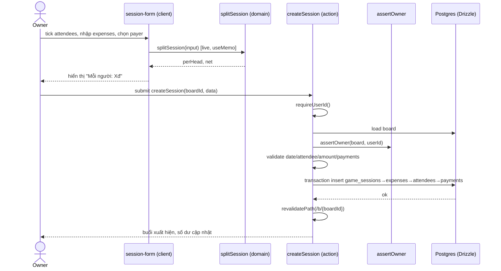
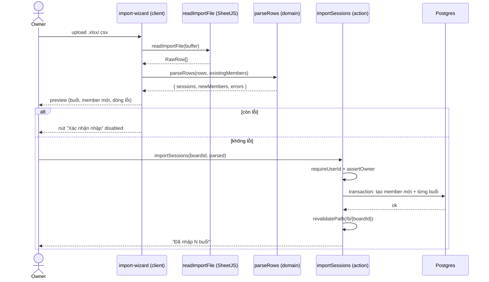
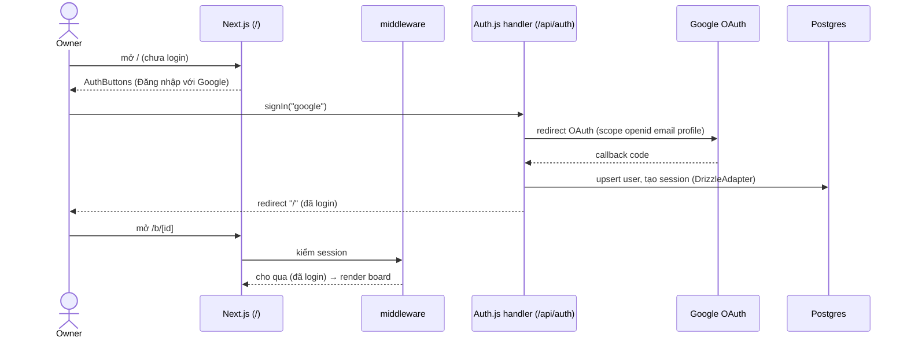
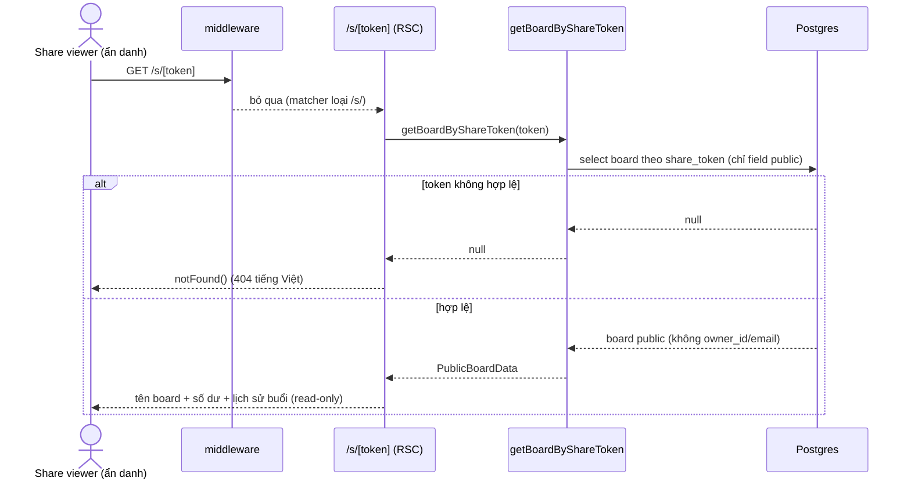

# SPEC — Chia Tiền Thể Thao (Technical Specification)

Phiên bản: 0.1
Ngày: 2026-06-29
Trạng thái: Draft (sẵn sàng chia task)
Tác giả: Principal Engineer / Solution Architect
Nguồn: design doc + PRD + SRS + implementation plan (đã chốt kỹ thuật)

Khi có mâu thuẫn giữa các tài liệu, ưu tiên implementation plan (2026-06-29-chia-tien-the-thao-implementation.md) vì đã chốt schema/naming/file layout. Các điểm lệch được ghi ở section 13 (Open Questions & Risks).

---

## 1. Introduction

### 1.1. Purpose (Mục đích)

Tài liệu này đặc tả thiết kế kỹ thuật chi tiết (Software Design Specification) cho sản phẩm "Chia Tiền Thể Thao" v1. Mục tiêu: cung cấp đủ chi tiết để 2 dev chia task và hiện thực trong 6–8 tuần, đảm bảo mọi yêu cầu chức năng (FR) trong SRS được phủ.

SPEC mô tả HOW: kiến trúc, mô hình dữ liệu chính xác, catalog Server Actions, hợp đồng hàm domain/query, thiết kế frontend, bảo mật, kiểm thử và migration. SPEC giữ naming 100% nhất quán với implementation plan (bảng plural snake_case, file kebab-case, function camelCase, ID = crypto.randomUUID() text PK).

### 1.2. References (Tài liệu tham chiếu)

- Design doc: docs/plans/2026-06-29-chia-tien-the-thao-design.md
- PRD: docs/plans/PRD.md
- SRS: docs/plans/SRS.md (nguồn FR cho traceability)
- Implementation plan: docs/plans/2026-06-29-chia-tien-the-thao-implementation.md (nguồn naming/schema/file layout chuẩn)
- Kiến trúc tham khảo: project sibling "mon-an-clone" (cùng stack Next.js 14 + Drizzle + Auth.js).

### 1.3. Glossary (Thuật ngữ)

- Board: không gian chia tiền của một nhóm, thuộc một owner; chứa members, game_sessions, settlements.
- Owner: user đăng nhập Google, sở hữu board.
- Member: tên người chơi trong phạm vi board, không gắn account.
- Session (buổi): bảng DB game_sessions; gồm date, note, attendees, expenses, payments.
- Expense: khoản chi (label + amount integer VND).
- Attendee: member có mặt trong một buổi.
- Payment: khoản tiền một member ứng cho buổi.
- Settlement: member trả tiền để cấn trừ số dư.
- Share (phần phải gánh): số tiền một member chịu trong một buổi.
- Net: trong một buổi, net = share − paid; dương = nợ.
- Balance (số dư tích lũy): Σ net qua các buổi − Σ settlement; dương = còn nợ quỹ, âm = được nhận lại.
- perHead: roundTo1000(total / số attendee).
- Remainder: total − perHead × số attendee, dồn vào bearer.
- Bearer: payer có mặt đầu tiên; nếu không có payer nào có mặt thì attendee[0].
- Share token: chuỗi ngẫu nhiên (crypto.randomUUID) gắn board cho trang public.
- Server Action: hàm "use server" của Next.js App Router, cơ chế mutation thay REST.
- vi-VN: định dạng tiền locale Việt Nam (1.234.000đ).

### 1.4. Design Goals (Mục tiêu thiết kế)

- DG1: Domain logic (chia tiền, số dư, parser) là hàm thuần lib/domain/, test 100% bằng vitest, không chạm DB/React.
- DG2: Mutation đi qua Server Actions + revalidatePath; chỉ một route handler HTTP cho Auth.js.
- DG3: Bảo mật owner-only: requireUserId() + assertOwner() bao mọi action ghi/đọc board, trừ trang share.
- DG4: Mobile-first, tiếng Việt 100%, tiền integer VND, hiển thị vi-VN, tabular-nums.
- DG5: Tổng số dư board luôn = 0 (bất biến toán học, có test bảo chứng).
- DG6: Greenfield, tối giản, không abstraction thừa (YAGNI theo design section 7).

---

## 2. System Architecture

### 2.1. Context (Bối cảnh)

```
   ┌──────────────┐  Google OAuth   ┌──────────────────┐
   │  Owner       │◄───────────────►│  Google Identity │
   │ (mobile/web) │                 └──────────────────┘
   └──────┬───────┘
          │ HTTPS (Server Actions + RSC)
          ▼
   ┌─────────────────────────────────────────────┐
   │  Next.js 14.2 App (Vercel)                   │
   │  - RSC pages (đọc) + Server Actions (ghi)    │
   │  - Auth.js v5 route handler /api/auth        │
   │  - middleware bảo vệ route                   │
   │  - lib/domain (pure) | lib/actions | queries │
   └──────────────────┬──────────────────────────┘
                      │ Drizzle ORM / @vercel/postgres
                      ▼
              ┌────────────────┐
              │ Vercel Postgres│
              └────────────────┘
          ▲
          │ HTTPS (read-only, không auth)
   ┌──────┴───────┐
   │ Share viewer │  →  /s/[token]
   │ (ẩn danh)    │
   └──────────────┘
```

### 2.2. Component (Thành phần)

- Presentation: app/ (RSC pages + client components trong components/). RSC fetch qua lib/queries; client component gọi Server Actions.
- Server Actions: lib/actions/ (boards, members, sessions, settlements, import) — validate, gọi Drizzle, revalidatePath.
- Domain (pure): lib/domain/ (money, split, guard, import-parse) — không side effect, test vitest.
- Data access: lib/db/ (schema.ts, index.ts), lib/queries.ts (read helpers).
- Auth: lib/auth.ts (NextAuth config + requireUserId), app/api/auth/[...nextauth]/route.ts, middleware.ts.
- File IO: lib/import-read.ts (đọc xlsx/csv qua SheetJS), components/download-template.tsx (sinh file mẫu client-side).

Quy tắc phụ thuộc: lib/domain không import bất cứ gì từ lib/db, lib/actions, next. lib/actions import lib/domain + lib/db + lib/auth. Pages import lib/queries (đọc) và lib/actions (ghi).

### 2.3. Deployment (Triển khai)

- Host: Vercel (Next.js serverless functions + edge middleware).
- DB: Vercel Postgres (pooled connection qua @vercel/postgres).
- Env: GOOGLE_CLIENT_ID, GOOGLE_CLIENT_SECRET, AUTH_SECRET, AUTH_URL, DATABASE_URL (map sang POSTGRES_URL nếu thiếu, theo lib/db/index.ts).
- Build: next build; migration chạy qua drizzle-kit (xem section 12).

### 2.4. Tech Stack Decisions (Quyết định + trade-off)

| Quyết định | Options đã xem xét | Chọn | Lý do |
|---|---|---|---|
| Mutation layer | REST API routes; tRPC; Server Actions | Server Actions | Next.js 14 App Router native, ít boilerplate, revalidatePath gắn chặt cache; không cần client fetch layer. Trade-off: khó test integration hơn REST, mitigate bằng tách domain thuần. |
| Session strategy | JWT; Database session | Database (DrizzleAdapter) | Theo plan; cho phép revoke session, lưu user thật ở DB. Trade-off: thêm 1 query DB mỗi request, chấp nhận ở quy mô nhóm nhỏ. |
| Auth provider | Google; email/password; multi | Google only (v1) | Owner đã có Google, giảm phạm vi. Trade-off: phụ thuộc Google khả dụng (A6). |
| Số dư | Lưu cột balance; tính derived | Tính derived từ session + settlement | Tránh lệch/đồng bộ; số dư luôn nhất quán với nguồn. Trade-off: tính lại mỗi lần đọc — chấp nhận vì board nhỏ. |
| Tiền | float; integer VND | Integer VND | Tránh lỗi làm tròn float; làm tròn tới 1.000đ theo BR-003. |
| Import file | Server upload + parse; client read + server confirm | Client đọc file (SheetJS) → parseRows thuần → server action ghi | Giảm tải server, preview tức thời; parser thuần test được. Trade-off: parse chạy ở browser, chấp nhận vì file nhỏ. |
| Ngày buổi | Kiểu date; text YYYY-MM-DD | text YYYY-MM-DD | Theo schema plan; tránh lệch timezone, khớp định dạng import. |

---

## 3. Data Model

Mọi bảng: ID = text PK mặc định crypto.randomUUID() (trừ bảng có composite PK). Tiền là integer (VND). Cột snake_case, bảng plural. Nguồn: implementation plan Task 3.1 — KHÔNG dùng TypeScript interface ở đây; dev convert sang Drizzle schema.

### 3.1. Bảng Auth.js (chuẩn DrizzleAdapter)

users
- id: text, PK, default crypto.randomUUID()
- name: text, nullable
- email: text, unique, nullable
- email_verified: timestamp(mode date), nullable
- image: text, nullable

accounts
- user_id: text, NOT NULL, FK users.id ON DELETE CASCADE
- type: text, NOT NULL
- provider: text, NOT NULL
- provider_account_id: text, NOT NULL
- refresh_token, access_token, token_type, scope, id_token, session_state: text, nullable
- expires_at: integer, nullable
- PK: (provider, provider_account_id)

sessions
- session_token: text, PK
- user_id: text, NOT NULL, FK users.id ON DELETE CASCADE
- expires: timestamp(mode date), NOT NULL

verification_tokens
- identifier: text, NOT NULL
- token: text, NOT NULL
- expires: timestamp(mode date), NOT NULL
- PK: (identifier, token)

### 3.2. Bảng Domain

boards
- id: text, PK, default crypto.randomUUID()
- owner_id: text, NOT NULL, FK users.id ON DELETE CASCADE
- name: text, NOT NULL
- share_token: text, NOT NULL, default crypto.randomUUID() — định danh trang public; xem index 3.3
- created_at: timestamptz, NOT NULL, default now()

members
- id: text, PK, default crypto.randomUUID()
- board_id: text, NOT NULL, FK boards.id ON DELETE CASCADE
- name: text, NOT NULL — duy nhất (case-insensitive) trong board: enforce ở tầng action (BR-009), không enforce DB ở v1

game_sessions
- id: text, PK, default crypto.randomUUID()
- board_id: text, NOT NULL, FK boards.id ON DELETE CASCADE
- date: text, NOT NULL — định dạng YYYY-MM-DD
- note: text, nullable
- created_at: timestamptz, NOT NULL, default now()

expenses
- id: text, PK, default crypto.randomUUID()
- session_id: text, NOT NULL, FK game_sessions.id ON DELETE CASCADE
- label: text, NOT NULL
- amount: integer, NOT NULL — VND nguyên dương (>0 enforce ở action)

attendees
- session_id: text, NOT NULL, FK game_sessions.id ON DELETE CASCADE
- member_id: text, NOT NULL, FK members.id ON DELETE CASCADE
- PK: (session_id, member_id)

payments
- id: text, PK, default crypto.randomUUID()
- session_id: text, NOT NULL, FK game_sessions.id ON DELETE CASCADE
- member_id: text, NOT NULL, FK members.id ON DELETE CASCADE
- amount: integer, NOT NULL — VND

settlements
- id: text, PK, default crypto.randomUUID()
- board_id: text, NOT NULL, FK boards.id ON DELETE CASCADE
- member_id: text, NOT NULL, FK members.id ON DELETE CASCADE
- amount: integer, NOT NULL — VND nguyên dương
- date: text, NOT NULL — YYYY-MM-DD
- note: text, nullable

### 3.3. Indexes (đề xuất)

- boards.share_token: UNIQUE index (truy vấn trang public theo token; bảo đảm không trùng). Plan để NOT NULL + default UUID; SPEC khuyến nghị thêm .unique() khi generate.
- boards.owner_id: index (list board theo owner).
- members.board_id: index. game_sessions.board_id: index. expenses.session_id: index. payments.session_id: index. attendees(session_id) đã có qua composite PK. settlements.board_id, settlements.member_id: index.

Ghi chú: v1 quy mô nhỏ, index trên là tối ưu nhẹ; FK columns nên có index để query/cascade nhanh.

### 3.4. Cascade & xóa

- Xóa users → cascade boards, accounts, sessions.
- Xóa boards → cascade members, game_sessions, settlements.
- Xóa game_sessions → cascade expenses, attendees, payments.
- Xóa members → cascade attendees, payments, settlements (theo FK ON DELETE CASCADE). Lưu ý hệ quả với FR-MEMBER-003 (xem Open Questions OQ4).

### 3.5. Quy ước dữ liệu

- Số dư là giá trị derived (không lưu cột); tính từ game_sessions (qua splitSession) và settlements (computeBalances).
- Mọi tiền integer VND; định dạng vi-VN chỉ ở tầng hiển thị (formatVnd).
- date lưu text YYYY-MM-DD; không dùng kiểu date để tránh lệch timezone.

---

## 4. API Design (Server Actions Catalog)

App KHÔNG dùng REST. Mọi mutation là Server Action ("use server") + revalidatePath. Endpoint HTTP duy nhất là route handler Auth.js. Trang public /s/[token] là RSC đọc (không action). Mọi action (trừ share) gọi requireUserId() và assertOwner() trước khi ghi.

### 4.1. Board actions — lib/actions/boards.ts

| Action | Signature | Auth/Guard | Side effects / revalidate | Errors |
|---|---|---|---|---|
| createBoard | createBoard(name: string): Promise<Board> | requireUserId | insert boards (owner_id, name, share_token auto); revalidatePath("/") | "Tên board trống" nếu trim rỗng; UnauthorizedError nếu chưa login |
| renameBoard | renameBoard(boardId: string, name: string): Promise<void> | requireUserId + assertOwner | update boards.name; revalidatePath(`/b/${boardId}`) | "Không tìm thấy board"; "Không có quyền"; tên trống |
| deleteBoard | deleteBoard(boardId: string): Promise<void> | requireUserId + assertOwner | delete boards (cascade con); revalidatePath("/") | "Không tìm thấy board"; "Không có quyền" |

### 4.2. Member actions — lib/actions/members.ts

| Action | Signature | Auth/Guard | Side effects / revalidate | Errors |
|---|---|---|---|---|
| addMember | addMember(boardId: string, name: string): Promise<Member> | requireUserId + assertOwner(board) | insert members; revalidatePath(`/b/${boardId}`) | tên trống; "Tên đã tồn tại" (case-insensitive); guard errors |
| renameMember | renameMember(memberId: string, name: string): Promise<void> | requireUserId + assertOwner(board chứa member) | update members.name; revalidatePath(`/b/${boardId}`) | tên trống; trùng; guard errors |
| removeMember | removeMember(memberId: string): Promise<void> | requireUserId + assertOwner | delete members (cascade attendees/payments/settlements); revalidatePath(`/b/${boardId}`) | guard errors; cảnh báo UI nếu member đã tham gia buổi (xem 6.5) |

### 4.3. Session actions — lib/actions/sessions.ts

| Action | Signature | Auth/Guard | Side effects / revalidate | Errors |
|---|---|---|---|---|
| createSession | createSession(boardId: string, data: SessionFormData): Promise<GameSession> | requireUserId + assertOwner | transaction: insert game_sessions → expenses → attendees → payments; revalidatePath(`/b/${boardId}`) | date sai định dạng; 0 attendee; amount không nguyên dương; payment.memberId ngoài board; guard errors |
| updateSession | updateSession(sessionId: string, data: SessionFormData): Promise<void> | requireUserId + assertOwner | transaction: xóa con + insert lại (expenses/attendees/payments) + update game_sessions; revalidatePath(`/b/${boardId}`) | như createSession |
| deleteSession | deleteSession(sessionId: string): Promise<void> | requireUserId + assertOwner | delete game_sessions (cascade con); revalidatePath(`/b/${boardId}`) | guard errors |

SessionFormData (shape, không phải TS interface chính thức): { date: string; note?: string; attendeeIds: string[]; expenses: { label: string; amount: number }[]; payments: { memberId: string; amount: number }[] }.

### 4.4. Settlement actions — lib/actions/settlements.ts

| Action | Signature | Auth/Guard | Side effects / revalidate | Errors |
|---|---|---|---|---|
| addSettlement | addSettlement(boardId: string, memberId: string, amount: number, date: string, note?: string): Promise<Settlement> | requireUserId + assertOwner | insert settlements; revalidatePath(`/b/${boardId}`) | amount không nguyên dương; date sai; guard errors |
| removeSettlement | removeSettlement(settlementId: string): Promise<void> | requireUserId + assertOwner | delete settlements; revalidatePath(`/b/${boardId}`) | guard errors |

### 4.5. Import action — lib/actions/import.ts

| Action | Signature | Auth/Guard | Side effects / revalidate | Errors |
|---|---|---|---|---|
| importSessions | importSessions(boardId: string, parsed: ParsedImport): Promise<{ count: number }> | requireUserId + assertOwner | transaction: tạo member còn thiếu + tạo từng buổi (expenses/attendees/payments) theo cùng logic createSession; revalidatePath(`/b/${boardId}`) | nếu parsed còn errors → từ chối ghi; guard errors |

ParsedImport là output của parseRows (xem 5.4). importSessions tin tưởng parsed nhưng vẫn re-resolve member theo tên trong board (idempotent với member đã có).

### 4.6. Auth route handler — app/api/auth/[...nextauth]/route.ts

- Export `{ GET, POST } = handlers` từ lib/auth.ts.
- Đường dẫn: /api/auth/* (signin, callback/google, signout, session, csrf).
- Cấu hình Google provider scope "openid email profile", session strategy "database", maxAge 30 ngày.

### 4.7. Trang public — app/s/[token]/page.tsx

- RSC, không action, không auth. `export const dynamic = "force-dynamic"`.
- Gọi getBoardByShareToken(token); nếu null → notFound() (trang 404 tiếng Việt).
- Chỉ trả tên board, bảng số dư, lịch sử buổi rút gọn. Tuyệt đối không trả owner_id/email.

### 4.8. Middleware matcher — middleware.ts

- `export { auth as middleware } from "@/lib/auth"`.
- matcher: `["/((?!api/auth|s/|_next|favicon.ico).*)"]` — bảo vệ mọi route trừ auth route, trang share, asset Next, favicon.

### 4.9. Error handling convention

- Action ném Error với message tiếng Việt ("Không có quyền", "Tên board trống", ...). UnauthorizedError cho trường hợp chưa đăng nhập.
- Client component bắt lỗi qua try/catch khi gọi action (hoặc useActionState) và hiển thị message tiếng Việt cho người dùng.
- Không leak stack/PII trong message. Lỗi validation diễn ra cả client (UX nhanh) và server (bảo mật, là nguồn chân lý).

### 4.10. Rate limiting

- Không có rate limit ứng dụng ở v1; dựa Vercel default platform protection. Quy mô nhóm nhỏ, owner-only ghi → rủi ro abuse thấp.

---

## 5. Business Logic / Services

Domain (lib/domain) thuần; Actions (lib/actions) điều phối; Queries (lib/queries) đọc. Dưới đây là hợp đồng JSDoc-style, KHÔNG code đầy đủ.

### 5.1. lib/domain/money.ts

```
/**
 * Làm tròn tới bội số gần nhất của 1.000 (BR-003).
 * @param n số tiền chưa làm tròn
 * @returns số nguyên VND đã làm tròn (Math.round(n/1000)*1000)
 */
roundTo1000(n: number): number

/**
 * Định dạng tiền VND theo locale vi-VN + hậu tố "đ".
 * @example formatVnd(1234000) -> "1.234.000đ"; formatVnd(0) -> "0đ"
 */
formatVnd(n: number): string
```
Side effects: none. Errors: none (giả định input số hợp lệ).

### 5.2. lib/domain/split.ts

```
/**
 * Chia đều chi phí một buổi cho người có mặt (FR-SPLIT-001, BR-002..BR-005, BR-008, BR-010).
 * total = Σ expense.amount; perHead = roundTo1000(total / nAttendee).
 * shares[attendee] = perHead; remainder = total - perHead*n dồn vào bearer
 * (payer có mặt đầu tiên, else attendee[0]) để Σ shares = total.
 * paid[member] = Σ payment.amount; net = share - paid; Σ net = 0.
 * Nếu attendeeIds rỗng: perHead=0, shares={}, net={} (buổi không hợp lệ để lưu).
 */
splitSession(input: SessionInput): SessionResult

/**
 * Số dư tích lũy mỗi member qua nhiều buổi trừ settlement (FR-BALANCE-001, BR-006).
 * balance[member] = Σ net(buổi) − Σ settlement.amount. Σ balance toàn board = 0.
 * Dương = còn nợ quỹ; âm = được nhận lại.
 */
computeBalances(
  sessions: SessionInput[],
  settlements: { memberId: string; amount: number }[]
): Record<string, number>
```
SessionInput: { expenses: { amount: number }[]; attendeeIds: string[]; payments: { memberId: string; amount: number }[] }.
SessionResult: { total, perHead, shares: Record<string,number>, paid: Record<string,number>, net: Record<string,number> }.
Side effects: none. Errors: none (hàm tổng quát hóa input rỗng). Lưu ý implementation plan: sửa nhánh early-return n===0 trả net: {} (đã chốt trong plan Task 2.2 step "Lưu ý").

### 5.3. lib/domain/guard.ts

```
/**
 * Khẳng định board tồn tại và thuộc về userId (FR-BOARD-004, BR-013, NFR-SEC-001).
 * @throws "Không tìm thấy board" nếu board undefined
 * @throws "Không có quyền" nếu board.ownerId !== userId
 */
assertOwner(board: { ownerId: string } | undefined, userId: string): asserts board
```
Side effects: none (chỉ throw). Dùng làm assertion type guard trong action.

### 5.4. lib/domain/import-parse.ts

```
/**
 * Phân tích các dòng template long-format thành buổi + member mới + lỗi (FR-IMPORT-002, BR-011, BR-012).
 * Input rows: object có khóa "ngày","khoản","số tiền","người ứng","người tham gia".
 * - Gom theo "ngày" thành một ParsedSession.
 * - Tách "người tham gia" theo dấu phẩy → trim → unique.
 * - Chuẩn hóa số tiền: bỏ "." nhóm và hậu tố "đ" ("200.000đ" -> 200000).
 * - Validate theo dòng: thiếu cột; ngày !== YYYY-MM-DD; số tiền không nguyên dương.
 * - newMembers: tên chưa có trong board; payer phải ∈ attendees hoặc tạo mới.
 * @returns { sessions: ParsedSession[]; newMembers: string[]; errors: { row: number; message: string }[] }
 */
parseRows(rows: RawRow[], existingMemberNames: string[]): ParsedImport
```
ParsedSession (shape): { date, expenses: { label, amount }[], attendeeNames: string[], payments: { memberName, amount }[] }.
Side effects: none. Errors: thu thập vào mảng errors (không throw); dòng lỗi không tạo buổi.

### 5.5. lib/auth.ts (service phụ trợ)

```
/** Lấy userId phiên hiện tại hoặc null. */ getCurrentUserId(): Promise<string | null>
/** Bắt buộc đăng nhập; @throws UnauthorizedError("Chưa đăng nhập"). */ requireUserId(): Promise<string>
```
Side effects: đọc session DB qua auth(). Export thêm { handlers, auth, signIn, signOut }.

### 5.6. lib/queries.ts (read helpers — không action)

```
/** Danh sách board của owner (FR-BOARD-004). */
getBoardsByOwner(userId: string): Promise<Board[]>

/**
 * Toàn bộ dữ liệu board: board + members + sessions (kèm expenses/attendees/payments) + settlements;
 * đóng gói thành SessionInput[] để feed computeBalances (FR-BALANCE-001).
 */
getBoardData(boardId: string): Promise<BoardData>

/** Board theo share token, KHÔNG cần auth; chỉ trả field public (không owner_id/email) (FR-SHARE-002). */
getBoardByShareToken(token: string): Promise<PublicBoardData | null>
```
Side effects: đọc DB (read-only). getBoardData KHÔNG tự kiểm quyền — caller (page) phải verify owner hoặc dùng cùng requireUserId/assertOwner; getBoardByShareToken cố ý bỏ qua owner và lọc field nhạy cảm.

### 5.7. lib/import-read.ts (file IO)

```
/** Đọc buffer file .xlsx/.csv → RawRow[] qua SheetJS sheet_to_json (defval: ""). (FR-IMPORT-002, SI-3) */
readImportFile(buffer: ArrayBuffer): RawRow[]
```
Side effects: parse in-memory; chạy client-side (browser). Errors: ném nếu file không đọc được (UI hiển thị tiếng Việt).

---

## 6. Frontend Design

### 6.1. Routes & Pages

| Route | File | Loại | Auth | Mô tả |
|---|---|---|---|---|
| / | app/page.tsx | RSC | yes | Trang chủ: chưa login → AuthButtons + mô tả; login → danh sách board + form tạo |
| /b/[id] | app/b/[id]/page.tsx | RSC | yes (owner) | Chi tiết board: tab Buổi + tab Số dư, nút Chia sẻ/Thành viên/Nhập từ Excel |
| /b/[id]/buoi | app/b/[id]/buoi/page.tsx | RSC + client form | yes (owner) | Form tạo/sửa buổi (màn quan trọng nhất) |
| /b/[id]/thanh-vien | app/b/[id]/thanh-vien/page.tsx | RSC + client | yes (owner) | Quản lý thành viên |
| /b/[id]/import | app/b/[id]/import/page.tsx | RSC + client | yes (owner) | Wizard import: upload → preview → xác nhận |
| /s/[token] | app/s/[token]/page.tsx | RSC | no | Trang chia sẻ read-only (force-dynamic) |
| /api/auth/* | app/api/auth/[...nextauth]/route.ts | route handler | n/a | Auth.js |

### 6.2. Shared Components (kebab-case .tsx, trong components/)

| Component | Loại | Vai trò |
|---|---|---|
| auth-buttons.tsx | server | Nút đăng nhập Google / đăng xuất (wrap signIn/signOut) |
| board-list.tsx | server | Danh sách board (link /b/{id}) |
| create-board-form.tsx | client | Form tạo board, gọi createBoard |
| board-tabs.tsx | client | Chuyển tab Buổi / Số dư |
| session-list.tsx | server | Tab Buổi: ngày, tổng, số người, perHead |
| balance-table.tsx | server | Tab Số dư: member + số dư, màu/nhãn theo dấu, nút Đánh dấu đã trả |
| session-form.tsx | client | Form tạo/sửa buổi, live perHead bằng splitSession |
| member-manager.tsx | client | Thêm/sửa/xóa member, cảnh báo khi xóa member đã tham gia |
| download-template.tsx | client | Nút tải file mẫu CSV (link tĩnh) + Excel (SheetJS client) |
| import-wizard.tsx | client | Upload → readImportFile → parseRows → preview → importSessions |

### 6.3. State Management

- Mặc định RSC + Server Actions; không thư viện state global.
- Client component dùng useState/useActionState cho form. Sau action thành công, revalidatePath làm RSC re-render dữ liệu mới.
- Live split (FR-SESSION-004) tính client-side: session-form gọi splitSession(input) trong useMemo theo expenses/attendees → hiển thị "Mỗi người: Xđ" tức thời (NFR-PERF-002), không round-trip server.

### 6.4. Forms & Validation

- create-board-form: tên trim, disable submit khi rỗng; lỗi server hiển thị tiếng Việt.
- session-form: ngày mặc định hôm nay; chip tick member (mặc định tick hết); preset "Sân/Cầu/Nước" thêm dòng expense; nhập amount số nguyên hiển thị formatVnd; payer mặc định một người = tổng; chặn submit khi 0 attendee hoặc amount không nguyên dương. Validate lại ở server (createSession).
- settlement form (trong balance-table): amount, date (mặc định hôm nay), note tùy chọn.
- member-manager: tên trim, chặn trống/trùng; cảnh báo trước khi xóa member đã tham gia buổi.
- import-wizard: nút "Xác nhận nhập" disabled khi còn dòng lỗi.

### 6.5. Mobile-first flow

- Layout 1 cột, touch target lớn, chip tick to dễ bấm. Màn tạo buổi tối ưu ít bước: mở form → tick người → preset chi → nhập tiền → thấy perHead → lưu (mục tiêu < 2 phút, NFR-PERF-001).
- Cảnh báo xóa member: dialog xác nhận tiếng Việt khi member có trong attendees.

### 6.6. Design Tokens

- CSS variables trong app/globals.css: --accent #0d9488 (teal), --money #ea580c (cam), --bg/--surface/--fg/--border, dark mode qua .dark. Map sang Tailwind trong tailwind.config.ts (bg, surface, ink, accent, money, line, ok, danger).
- Font Inter subset ["latin","vietnamese"], biến --font-inter.
- Class .num (font-variant-numeric: tabular-nums) cho cột tiền (UI-4, NFR-USE-002).
- Số dư: dương "còn nợ" màu danger (đỏ), âm "được nhận" màu ok (xanh) (UI-5).
- :focus-visible outline accent; prefers-reduced-motion giảm transition (NFR-USE-003). Dark mode tùy chọn (OQ8).

---

## 7. Background Jobs

Không có. App không có cron job, message queue, pub/sub, hay scheduled trigger.

Lý do: số dư là derived tính on-read; mọi mutation đồng bộ trong request qua Server Action + revalidatePath. Không có tác vụ nền (gửi email, đồng bộ, tổng hợp định kỳ) trong phạm vi v1. Nếu sau này cần (ví dụ nhắc nợ định kỳ — ngoài scope, O2 push notification), có thể thêm Vercel Cron, nhưng KHÔNG thuộc v1.

---

## 8. Integrations

- Google OAuth 2.0 (qua Auth.js v5, SI-1): scope "openid email profile"; redirect /api/auth/callback/google. Creds qua env GOOGLE_CLIENT_ID/SECRET. Phụ thuộc Google khả dụng (A6).
- Vercel Postgres (SI-2): qua @vercel/postgres + Drizzle. DATABASE_URL (pooled).
- SheetJS / xlsx (SI-3): đọc .xlsx/.csv (import) và sinh .xlsx (file mẫu) client-side. Không upload file lên server thô — chỉ gửi ParsedImport đã phân tích qua action.
- Không tích hợp Slack, Email, SMS, push notification, analytics bên thứ ba ở v1.

---

## 9. Security

- Xác thực: Auth.js v5 Google, session DB. requireUserId() ném UnauthorizedError nếu chưa login.
- RBAC owner-only: mọi action ghi/đọc board gọi requireUserId() + assertOwner(board, userId) (FR-BOARD-004, BR-013, NFR-SEC-001). Member/Session/Settlement action load board (qua quan hệ con) rồi assertOwner.
- Route protection: middleware.ts matcher chặn mọi route trừ /api/auth, /s/, _next, favicon (FR-AUTH-003). Truy cập board không thuộc owner → redirect/từ chối.
- Share token: crypto.randomUUID() (122-bit entropy) → unguessable; trang /s/[token] không cần auth nhưng chỉ trả field public (FR-SHARE-002, NFR-SEC-002). KHÔNG trả owner_id/email/share_token của board khác.
- Public leak prevention: getBoardByShareToken select tường minh field an toàn; component trang share không nhận object board đầy đủ.
- Input validation tại boundary server action: trim tên, date YYYY-MM-DD, amount integer > 0, attendee ≥ 1, payment.memberId ∈ board. Validation client chỉ để UX; server là nguồn chân lý.
- Secrets: GOOGLE_CLIENT_SECRET, AUTH_SECRET, DATABASE_URL qua env, không hardcode (NFR-SEC-003). HTTPS mặc định Vercel.
- Không có revoke share token ở v1 (OQ2). Không có chuyển owner (OQ1).

---

## 10. Non-Functional Implementation

### 10.1. Performance

- Live split tính client (useMemo) → tức thời (NFR-PERF-002).
- RSC fetch dữ liệu board 1 lần qua getBoardData; computeBalances chạy O(buổi × member) in-memory — nhẹ ở quy mô nhóm.
- Index FK column (3.3) hỗ trợ query/cascade.

### 10.2. Reliability

- createSession/updateSession/import ghi trong db.transaction → atomic, không để dữ liệu một phần (NFR-REL-002).
- Số dư derived → luôn nhất quán; bất biến Σ balance = 0 có test bảo chứng (NFR-REL-001).

### 10.3. Error handling

- Action ném Error message tiếng Việt; client bắt và hiển thị. Validation 2 tầng (client UX + server chân lý). Không leak PII/stack.

### 10.4. Caching / revalidatePath

- Mỗi mutation gọi revalidatePath đúng scope: createBoard/deleteBoard → "/"; rename/member/session/settlement/import → `/b/{boardId}`.
- Trang share force-dynamic (luôn fresh, không cache stale số dư).
- RSC mặc định cache theo Next; revalidatePath làm mới sau ghi.

---

## 11. Testing Strategy

### 11.1. Unit (vitest, lib/domain — không chạm DB)

money.test.ts (FR liên quan: SPLIT/BALANCE display):
- roundTo1000(33333)=33000; roundTo1000(33500)=34000; roundTo1000(100000)=100000.
- formatVnd(1234000)="1.234.000đ"; formatVnd(0)="0đ".

split.test.ts (FR-SPLIT-001):
- Chia khít: total 300000, [a,b,c], a ứng 300000 → perHead 100000, net {a:-200000,b:100000,c:100000}, Σnet=0.
- Lẻ dồn payer: total 100000, [a,b,c], a ứng 100000 → perHead 33000, remainder 1000 vào a → shares {a:34000,b:33000,c:33000}, Σshares=100000, Σnet=0.
- Payer vắng: total 100000, [b,c], a ứng 100000 → shares {b:50000,c:50000}, net.a=-100000.
- 0 attendee → perHead 0, shares {}, net {}.

balance.test.ts (FR-BALANCE-001):
- 2 buổi cộng dồn → bal {a:-100000,b:0,c:100000}, Σ=0.
- Settlement giảm nợ: c=100000 → bal.c=0, bal.a=-200000.
- Bất biến: với fixture bất kỳ, Σ balance = 0.

guard.test.ts (FR-BOARD-004):
- assertOwner(undefined,…) throws "Không tìm thấy board".
- assertOwner({ownerId:"x"},"y") throws "Không có quyền".
- assertOwner({ownerId:"x"},"x") pass.

import-parse.test.ts (FR-IMPORT-002):
- 2 dòng cùng ngày → 1 buổi 2 expenses, 3 attendees (trim, unique).
- "200.000đ" → 200000.
- Thiếu cột số tiền hoặc ngày "20/06/2026" → errors có dòng tương ứng.
- Tên người tham gia mới → newMembers chứa tên đó.

### 11.2. Integration (Server Actions)

- Test thủ công hoặc với DB test: createBoard → addMember → createSession → getBoardData → số dư đúng; assertOwner chặn user khác (giả lập session). Ưu tiên giữ logic ở domain để unit phủ; action test mức smoke khi có DB.

### 11.3. E2E thủ công (KPI4)

Luồng: đăng nhập Google → tạo board → thêm member → tạo buổi (tick người, preset chi, payer, xem perHead) → xem tab Số dư → đánh dấu đã trả → mở /s/[token] ẩn danh → import file mẫu (preview → xác nhận → "Đã nhập N buổi").

### 11.4. Data seed

- Greenfield: không seed production. Có thể seed local: 1 board, 3 member, 2 buổi mẫu để test UI/số dư. File mẫu import: public/templates/mau-nhap-lieu.csv (đã có trong plan Task 8.3).

---

## 12. Migration Plan

Greenfield — chủ yếu setup ban đầu, không backward-compat.

1. Env: tạo .env.local từ .env.example (GOOGLE_CLIENT_ID/SECRET, AUTH_SECRET via `npx auth secret`, AUTH_URL, DATABASE_URL pooled).
2. Schema: viết lib/db/schema.ts (section 3) + drizzle.config.ts.
3. Generate: `npm run db:generate` → tạo SQL trong drizzle/.
4. Apply: dev/local `npm run db:push`; production `npm run db:migrate` (drizzle-kit migrate với --env-file).
5. Auth tables: DrizzleAdapter cần users/accounts/sessions/verification_tokens — generate cùng schema.
6. Index: bổ sung .unique() cho share_token và index FK khi generate (section 3.3).
7. Deploy: Vercel + Vercel Postgres; set env; cấu hình Google OAuth redirect (localhost + production domain).
8. Backward compat: không áp dụng (v1 đầu tiên). Thay đổi schema sau v1 dùng drizzle-kit generate migration mới.

---

## 13. Open Questions & Risks

Kế thừa OQ1–OQ8 từ PRD; bổ sung điểm lệch giữa tài liệu (ưu tiên implementation plan):

- OQ1: Chuyển/đa owner board? v1 giả định một owner cố định (chưa hỗ trợ chuyển).
- OQ2: Revoke/đổi share token khi lộ link? v1 share token cố định, chưa có revoke.
- OQ3: Phân trang khi board nhiều buổi? Chưa bắt buộc v1 (NFR-SCAL-001).
- OQ4: Xóa member đã tham gia buổi — schema FK ON DELETE CASCADE sẽ xóa kèm attendees/payments/settlements, làm thay đổi số dư các buổi liên quan. SRS FR-MEMBER-003 nói "cảnh báo rồi cho phép xóa". RỦI RO: xóa cascade làm lệch lịch sử buổi. Cần quyết định: chặn xóa nếu đã tham gia, hay soft-delete, hay chấp nhận cascade. v1 mặc định: cảnh báo + cascade (theo schema plan).
- OQ5: Giới hạn kích thước/định dạng/số dòng file import? Chưa quy định; rủi ro file lớn parse chậm ở client.
- OQ6: Import còn 1 dòng lỗi → chặn toàn bộ (nút xác nhận disabled). v1 chốt: chặn toàn bộ (FR-IMPORT-004).
- OQ7: Hiển thị note buổi/settlement ở UI? Schema có cột note; UI hiển thị tùy chọn (chưa bắt buộc).
- OQ8: Dark mode bắt buộc hay tùy chọn? v1: tùy chọn (Phase 9, nếu còn thời gian).

Điểm lệch tài liệu (đã giải quyết theo implementation plan):
- Design doc đặt bảng "Session"; plan + SRS dùng tên bảng DB game_sessions. SPEC dùng game_sessions (table) / "buổi" (thuật ngữ UI) / Session (domain type). Không mâu thuẫn.
- Plan có lưu ý sửa nhánh early-return splitSession khi n===0 trả net: {} (đã phản ánh ở 5.2).
- Uniqueness tên member: enforce ở action (case-insensitive), KHÔNG ràng buộc DB ở v1 (BR-009) — rủi ro race hiếm gặp ở quy mô owner-only, chấp nhận.

Risks: phụ thuộc Google OAuth khả dụng; @vercel/postgres cold start serverless; parse file lớn ở client.

---

## 14. Traceability Matrix (SRS FR → SPEC)

| SRS FR | SPEC section / action / service |
|---|---|
| FR-AUTH-001 (Đăng nhập Google) | 4.6 route handler; 5.5 lib/auth; 8 Google OAuth; 15.4 sequence |
| FR-AUTH-002 (Đăng xuất) | 4.6; 6.2 auth-buttons; 5.5 signOut |
| FR-AUTH-003 (Bảo vệ route) | 4.8 middleware; 9 Security |
| FR-BOARD-001 (Tạo board) | 4.1 createBoard; 6.1 /, 6.2 create-board-form |
| FR-BOARD-002 (Đổi tên board) | 4.1 renameBoard; 5.3 assertOwner |
| FR-BOARD-003 (Xóa board) | 4.1 deleteBoard; 3.4 cascade |
| FR-BOARD-004 (Cô lập theo owner) | 9 RBAC; 5.3 guard; 5.6 getBoardsByOwner; 4.8 middleware |
| FR-MEMBER-001 (Thêm member) | 4.2 addMember; 6.2 member-manager; BR-009 validation |
| FR-MEMBER-002 (Sửa member) | 4.2 renameMember |
| FR-MEMBER-003 (Xóa member + cảnh báo) | 4.2 removeMember; 6.5 cảnh báo; OQ4 |
| FR-SESSION-001 (Tạo buổi) | 4.3 createSession; 6.4 session-form; 10.2 transaction; 15.1 |
| FR-SESSION-002 (Preset + free-form label) | 6.4 session-form (preset Sân/Cầu/Nước) |
| FR-SESSION-003 (Chọn payer) | 4.3 SessionFormData.payments; 6.4 |
| FR-SESSION-004 (Live perHead) | 6.3 live split; 5.2 splitSession; NFR-PERF-002 |
| FR-SESSION-005 (Danh sách buổi) | 6.2 session-list; 5.6 getBoardData |
| FR-SESSION-006 (Sửa buổi) | 4.3 updateSession |
| FR-SESSION-007 (Xóa buổi) | 4.3 deleteSession; 3.4 cascade |
| FR-SPLIT-001 (Chia tiền buổi) | 5.2 splitSession; 11.1 split.test; 15.1 |
| FR-BALANCE-001 (Số dư tích lũy) | 5.2 computeBalances; 5.6 getBoardData; 11.1 balance.test; 15.2 |
| FR-BALANCE-002 (Bảng số dư) | 6.2 balance-table; 6.6 màu/nhãn |
| FR-SETTLE-001 (Ghi settlement) | 4.4 addSettlement; 6.4 settlement form |
| FR-SETTLE-002 (Xóa settlement) | 4.4 removeSettlement |
| FR-SETTLE-003 (Không định tuyến ai-chuyển-ai) | 5.2 computeBalances (chỉ số dư); 6.2 balance-table |
| FR-SHARE-001 (Share link) | 3.2 share_token; 6.2 nút Chia sẻ; 15.5 |
| FR-SHARE-002 (Trang public read-only) | 4.7 /s/[token]; 5.6 getBoardByShareToken; 9 leak prevention; 15.5 |
| FR-IMPORT-001 (Tải file mẫu) | 6.2 download-template; 8 SheetJS |
| FR-IMPORT-002 (Đọc + phân tích) | 5.4 parseRows; 5.7 readImportFile; 11.1 import-parse.test; 15.3 |
| FR-IMPORT-003 (Preview) | 6.2 import-wizard; 15.3 |
| FR-IMPORT-004 (Xác nhận + ghi) | 4.5 importSessions; 10.2 transaction; OQ6; 15.3 |
| BR-001..BR-013 | 3.5, 5.2, 5.3, 5.4, 9 (rải theo rule) |
| NFR-PERF-001/002 | 6.5, 6.3, 10.1 |
| NFR-SEC-001/002/003 | 9 Security |
| NFR-REL-001/002 | 10.2 |
| NFR-USE-001/002/003 | 6.6, 6.5 |
| NFR-MAINT-001/002 | 1.4 DG1, 2.2, 3 naming |
| NFR-COMP-001 | 3.5, 5.1 |
| NFR-SCAL-001 | 10.1; OQ3 |

Mọi FR module (AUTH, BOARD, MEMBER, SESSION, SPLIT, BALANCE, SETTLE, SHARE, IMPORT) có ≥1 dòng phủ.

---

## 15. Sequence Diagrams

### 15.1. Tạo buổi + chia tiền (createSession)



### 15.2. Tính số dư tích lũy (getBoardData → computeBalances)

```mermaid
sequenceDiagram
  participant Page as /b/[id] (RSC)
  participant Q as getBoardData (query)
  participant DB as Postgres
  participant Bal as computeBalances (domain)
  participant Split as splitSession (domain)
  Page->>Q: getBoardData(boardId)
  Q->>DB: select board+members+sessions(expenses,attendees,payments)+settlements
  DB-->>Q: rows
  Q->>Q: đóng gói SessionInput[] + settlements
  Q->>Bal: computeBalances(sessions, settlements)
  loop mỗi buổi
    Bal->>Split: splitSession(session) → net
  end
  Bal->>Bal: Σ net − Σ settlement; Σ balance = 0
  Bal-->>Q: balance per member
  Q-->>Page: BoardData (render balance-table)
```

### 15.3. Import: preview → confirm



### 15.4. Đăng nhập Google



### 15.5. Xem trang share


